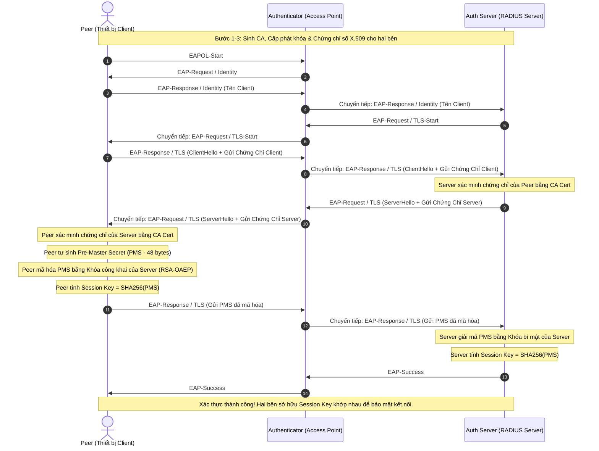

# EAP-TLS Authentication Simulation (Mô Phỏng Xác Thực EAP-TLS)

Dự án này là một chương trình mô phỏng hoàn chỉnh và trực quan về giao thức xác thực mạng bảo mật mạnh mẽ **EAP-TLS** (Extensible Authentication Protocol - Transport Layer Security) viết bằng ngôn ngữ **C++**, sử dụng thư viện **OpenSSL** để thực hiện các thao tác mật mã hóa thực tế.

Giao thức **EAP-TLS** (được định nghĩa trong RFC 5216) là tiêu chuẩn vàng trong xác thực mạng không dây doanh nghiệp (WPA3-Enterprise / 802.1X) và xác thực hạ tầng mạng. Nó yêu cầu xác thực hai chiều dựa trên chứng chỉ số X.509 giữa thiết bị người dùng (Peer) và máy chủ xác thực (Authentication Server).

---

## Các Tính Năng

1. **Sinh Chứng Chỉ Tự Động (CA & X.509)**: Tự động khởi tạo một Certificate Authority (CA) nội bộ và cấp phát chứng chỉ số thực tế cùng khóa bí mật (RSA 2048-bit) cho cả Client (Peer) và Server.
2. **Kiểm Tra Chuỗi Chứng Chỉ Thực**: Sử dụng thư viện OpenSSL để thực hiện xác minh chứng chỉ chéo (Peer xác minh Server, Server xác minh Peer) dựa trên chứng chỉ CA chung.
3. **Mô Phỏng Kiến Trúc 3 Thành Phần (802.1X)**:
   - **EAP Peer (Client)**: Thiết bị yêu cầu kết nối mạng.
   - **EAP Authenticator (Access Point / Switch / NAS)**: Bộ trung chuyển dữ liệu trung gian.
   - **Authentication Server (RADIUS / AAA Server)**: Máy chủ xác thực trung tâm.
4. **Trao Đổi Khóa Bằng Mật Mã Hóa Bất Đối Xứng**: Mô phỏng quá trình sinh **Pre-Master Secret (48 bytes)** ngẫu nhiên từ phía Peer, mã hóa bằng khóa công khai của Server qua cơ chế **RSA-OAEP**, truyền tải an toàn và giải mã ở phía Server.
5. **Tự Tạo Khóa Phiên (Session Key Derivation)**: Sử dụng hàm băm mật mã học **SHA-256** từ Pre-Master Secret để hai bên độc lập đồng bộ hóa ra khóa phiên đối xứng (Session Key) dùng cho việc mã hóa kênh truyền sau này.

---

## Sơ Đồ Quy Trình Xác Thực (Mermaid Diagram)

Quy trình trao đổi thông điệp EAP-TLS được mô phỏng chi tiết theo chuẩn 802.1X như sau:



---

## Cấu Trúc Mã Nguồn

```text
EAP-TLS-DEMO/
├── EAP-TLS-DEMO.sln             # File Solution của Visual Studio
├── EAP-TLS-DEMO.vcxproj         # File Project của Visual Studio
├── messages.h                   # Định nghĩa các loại thông điệp EAP/EAP-TLS
├── cert_utils.h / .cpp          # Các hàm tiện ích OpenSSL (Tạo khóa, Tạo Cert, Xác minh, Mã hóa/Giải mã)
├── peer.h / .cpp                # Đại diện cho EAP Peer (Client)
├── authenticator.h / .cpp       # Đại diện cho EAP Authenticator (NAS)
├── auth_server.h / .cpp         # Đại diện cho Authentication Server (AAA Server)
└── main.cpp                     # Điểm khởi chạy chương trình & Điều phối mô phỏng
```

### Chi Tiết Từng File

*   `messages.h`: Khai báo các hằng số chuỗi cho các giai đoạn xác thực như `EAPOL_START`, `EAP_REQUEST_IDENTITY`, `EAP_RESPONSE_IDENTITY`, `EAP_TLS_CLIENT_HELLO`, `EAP_TLS_SERVER_HELLO`, `EAP_TLS_PREMASTER_SECRET`, `EAP_SUCCESS`, v.v.
*   `cert_utils.cpp`: Triển khai các API OpenSSL cấp thấp nhưng hiện đại (tương thích OpenSSL 1.1.1 & 3.x), sử dụng `EVP_PKEY` thay thế cho các API cũ đã bị gạch bỏ (deprecated).
    *   Sinh cặp khóa RSA-2048 (`generate_key`)
    *   Tạo chứng chỉ X.509 từ thông tin Subject, Issuer, Khóa (`generate_cert`) và cấu hình Basic Constraints `CA:TRUE` cho chứng chỉ CA.
    *   Kiểm tra tính hợp lệ của chuỗi chứng chỉ bằng `X509_verify_cert` (`verify_cert`).
    *   Mã hóa RSA-OAEP bằng khóa công khai (`encrypt_with_cert_pubkey`) và giải mã bằng khóa bí mật (`decrypt_with_key`).
*   `peer.cpp`: Xử lý luồng máy trạng thái của Client. Khi nhận được chứng chỉ Server, tiến hành xác thực chứng chỉ, sinh 48 bytes ngẫu nhiên làm tiền khóa (Pre-Master Secret), mã hóa nó và gửi đi, đồng thời băm SHA-256 để tạo Session Key.
*   `auth_server.cpp`: Kiểm tra chứng chỉ của Peer, gửi chứng chỉ Server cho Peer, nhận khóa PMS đã mã hóa, giải mã để lấy PMS gốc và tạo Session Key trùng khớp với Peer.
*   `authenticator.cpp`: Hoạt động như một bộ lọc và chuyển hướng. Nó không can thiệp vào các luồng dữ liệu TLS mã hóa, chỉ đóng vai trò đóng gói và chuyển phát thông điệp giữa Peer và Server.

---

## Yêu Cầu Hệ Thống & Hướng Dẫn Cài Đặt

### 1. Yêu cầu bắt buộc
*   Trình biên dịch hỗ trợ **C++17** hoặc mới hơn (MSVC, GCC, Clang).
*   **Thư viện OpenSSL** (Phiên bản 1.1.1 hoặc 3.x trở lên) đã được cài đặt trên hệ thống và cấu hình đường dẫn thư viện (Include & Library path).

### 2. Hướng dẫn Biên dịch trên Windows (Visual Studio)
Dự án đã tích hợp sẵn file `.sln` và `.vcxproj` cho Visual Studio:
1. Mở file `EAP-TLS-DEMO.sln` bằng **Visual Studio**.
2. Đảm bảo cấu hình dự án trỏ đúng đến vị trí cài đặt của OpenSSL:
   - Nhấp chuột phải vào Project `EAP-TLS-DEMO` -> **Properties**.
   - Mục **C/C++** -> **General** -> **Additional Include Directories**: Thêm đường dẫn tới thư mục `include` của OpenSSL (Ví dụ: `C:\Program Files\OpenSSL-Win64\include`).
   - Mục **Linker** -> **General** -> **Additional Library Directories**: Thêm đường dẫn tới thư mục `lib` của OpenSSL (Ví dụ: `C:\Program Files\OpenSSL-Win64\lib\VC\x64\MT` hoặc tương đương).
   - Mục **Linker** -> **Input** -> **Additional Dependencies**: Đảm bảo đã liên kết với `libssl.lib` và `libcrypto.lib`.
3. Chọn cấu hình `Debug` hoặc `Release` (x64).
4. Nhấn **F5** hoặc nhấp **Start** để biên dịch và chạy.

### 3. Hướng dẫn Biên dịch trên Linux (GCC / G++)
Nếu muốn chạy dự án này trên môi trường Linux, bạn có thể dễ dàng biên dịch bằng lệnh `g++` trực tiếp:
```bash
# Cài đặt OpenSSL Development Package nếu chưa có
sudo apt-get install libssl-dev

# Biên dịch dự án
g++ -std=c++17 main.cpp cert_utils.cpp peer.cpp authenticator.cpp auth_server.cpp -o eap_tls_demo -lssl -lcrypto

# Chạy chương trình
./eap_tls_demo
```

---

## Minh Họa Luồng Hoạt Động (Simulation Console Output)

1.  **Khởi tạo CA (Certificate Authority)**:
    *   Sinh Private Key cho CA dưới dạng PEM.
    *   Tự ký (Self-signed) tạo chứng chỉ CA (Issuer=CA, Subject=CA).
2.  **Khởi tạo Thông Tin Đăng Nhập cho Server và Peer**:
    *   Tạo Private Key riêng cho Server và Peer.
    *   Ký chứng chỉ số X.509 cho Server và Peer thông qua khóa của CA gốc.
3.  **Khởi tạo các thành phần thực thể**:
    *   Tạo đối tượng `AuthenticationServer`, `EAPAuthenticator`, `EAPPeer` với chứng chỉ số tương ứng.
4.  **Luồng bắt tay EAP-TLS chi tiết**:
    ```text
    === STEP 5: STARTING EAP-TLS AUTHENTICATION PROCESS ===
    Initiating EAP-TLS handshake...
    ==========================================
    [Peer] Starting EAP-TLS authentication process
    [Peer] Sending EAPOL-Start message
    [Authenticator] Received from Peer: EAPOL-Start
    [Authenticator] EAPOL-Start received, requesting client identity
    [Peer] Received message: EAP-Request/Identity
    [Peer] Responding with identity: Peer
    [Authenticator] Received from Peer: EAP-Response/Identity
    [Authenticator] Forwarding message to Authentication Server
    [AuthServer] Received message: EAP-Response/Identity
    [AuthServer] Client identity received: Peer
    [AuthServer] Sending TLS-Start request to initiate handshake
    [Authenticator] Sending to Peer: EAP-Request/TLS-Start
    [Peer] Received message: EAP-Request/TLS-Start
    [Peer] Starting TLS handshake - sending client certificate
    [Peer] Client Certificate being sent:
    -----BEGIN CERTIFICATE-----
    ... [Mã hóa PEM chứng chỉ Client] ...
    -----END CERTIFICATE-----
    
    [Authenticator] Received from Peer: EAP-TLS-ClientHello
    [Authenticator] Forwarding message to Authentication Server
    [AuthServer] Received message: EAP-TLS-ClientHello
    [AuthServer] Received client certificate, parsing and verifying...
    [AuthServer] Peer certificate verification SUCCESS
    [AuthServer] Certificate chain validation passed
    [AuthServer] Sending server certificate to client
    [Authenticator] Sending to Peer: EAP-TLS-ServerHello
    [Peer] Received message: EAP-TLS-ServerHello
    [Peer] Received server certificate, verifying...
    [Peer] Server certificate verification SUCCESS
    [Peer] Generated Pre-Master Secret (48 bytes):
    [Peer] Pre-Master Secret (hex): a1b2c3d4e5f6...
    [Peer] Pre-Master Secret encrypted with server's public key
    [Peer] Session Key generated (SHA256 of PMS):
    [Peer] Session Key (hex): f3b8c9d0...
    [Peer] Sending encrypted Pre-Master Secret to server
    [Authenticator] Received from Peer: EAP-TLS-PreMasterSecret
    [Authenticator] Forwarding message to Authentication Server
    [AuthServer] Received message: EAP-TLS-PreMasterSecret
    [AuthServer] Received encrypted Pre-Master Secret
    [AuthServer] Pre-Master Secret decrypted successfully
    [AuthServer] Decrypted PMS (hex): a1b2c3d4e5f6...
    [AuthServer] Session Key generated (SHA256 of PMS):
    [AuthServer] Session Key (hex): f3b8c9d0...
    [AuthServer] Authentication SUCCESS! TLS handshake completed
    [AuthServer] Secure session established
    [Authenticator] Sending to Peer: EAP-Success
    [Peer] Received message: EAP-Success
    [Peer] Authentication SUCCESS! EAP-TLS handshake completed
    [Peer] Secure session established with session key
    ==========================================
    ✓ EAP-TLS Authentication Process Completed
    ```

---

## Lưu Ý Bảo Mật & Học Thuật

> [!NOTE]
> Đây là một ứng dụng **Mô Phỏng (Simulation)** phục vụ cho mục đích học tập, nghiên cứu và hiểu sâu hơn về kiến trúc xác thực của mạng 802.1X.
> Trong thực tế triển khai:
> - Dữ liệu TLS sẽ được bao bọc trong các gói tin thực sự (EAP-TLS records) thay vì truyền đi dưới dạng text thuần túy trong Console.
> - Các bản tin EAP giữa Authenticator và Authentication Server sẽ được định dạng theo chuẩn **RADIUS** (RFC 2865) hoặc **Diameter** đóng gói qua UDP/TCP.
> - Quá trình sinh khóa phiên thực tế tuân theo cơ chế PRF (Pseudorandom Function) phức tạp hơn của chuẩn TLS (TLS 1.2 / TLS 1.3) thay vì chỉ sử dụng hàm SHA256 trực tiếp trên Pre-Master Secret.

---

## Tác giả

Dự án được xây dựng và phát triển nhằm minh họa chi tiết về mật mã học ứng dụng và an toàn thông tin mạng. Mọi đóng góp cải tiến đều được chào đón thông qua Pull Requests!
