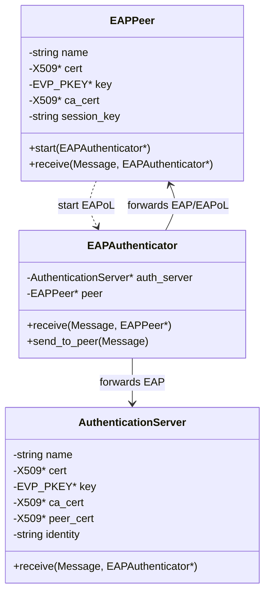

# 3: Lập trình OpenSSL EVP API và Thiết kế Máy trạng thái C++

Tài liệu này đi sâu vào khía cạnh lập trình thực tế, phân tích kỹ thuật sử dụng thư viện **OpenSSL EVP (Envelope Cryptography) API** tương thích chuẩn **OpenSSL 3.x**, thiết kế máy trạng thái các cấu trúc lớp C++ trong dự án, và các biện pháp bảo mật quản lý bộ nhớ.

---

## 1. Khám phá OpenSSL EVP API trong OpenSSL 3.x

Một trong những ưu điểm lớn nhất của dự án này là việc sử dụng bộ API hiện đại **EVP** của OpenSSL thay cho các API cấu trúc RSA cấp thấp cũ (như `RSA*`, `RSA_new`, `RSA_generate_key_ex` - các hàm này đã bị đánh dấu **deprecated** từ bản OpenSSL 3.0 và sẽ bị loại bỏ hoàn toàn trong tương lai).

### 1.1. Khái niệm EVP (Envelope Cryptography)
EVP là lớp giao diện cấp cao của OpenSSL trừu tượng hóa các thuật toán mã hóa cụ thể. Dù bạn sử dụng thuật toán RSA, ECDSA, Ed25519 hay SM2, bạn đều tương tác qua một cấu trúc kiểu dữ liệu thống nhất là `EVP_PKEY` và bộ ngữ cảnh cấu hình `EVP_PKEY_CTX`. Việc này mang lại tính linh hoạt cực lớn, giúp dễ dàng chuyển đổi thuật toán mật mã trong tương lai mà không cần viết lại toàn bộ chương trình.

### 1.2. Sinh cặp khóa bất đối xứng (`cert_utils.cpp` - L15-L27)
Để tạo ra một khóa bất đối xứng RSA 2048-bit tiêu chuẩn, mã nguồn sử dụng tiến trình EVP chuẩn:

```cpp
EVP_PKEY* generate_key() {
    // 1. Tạo ngữ cảnh sinh khóa (Context) cho thuật toán RSA
    EVP_PKEY_CTX* ctx = EVP_PKEY_CTX_new_id(EVP_PKEY_RSA, NULL);
    if (!ctx) return NULL;
    
    // 2. Khởi tạo tác vụ sinh khóa
    EVP_PKEY_keygen_init(ctx);
    
    // 3. Thiết lập độ dài khóa (RSA_KEYGEN_BITS) là 2048
    EVP_PKEY_CTX_set_rsa_keygen_bits(ctx, 2048);
    
    // 4. Tiến hành sinh khóa và gán vào con trỏ pkey
    EVP_PKEY* pkey = NULL;
    EVP_PKEY_keygen(ctx, &pkey);
    
    // 5. Giải phóng ngữ cảnh tránh rò rỉ bộ nhớ
    EVP_PKEY_CTX_free(ctx);
    return pkey;
}
```

### 1.3. Khởi tạo Chứng chỉ số X.509 v3 và cấu hình Tiện ích mở rộng
Quá trình tạo chứng chỉ số được thực hiện qua các bước thiết lập cấu trúc `X509*`:

1.  **Thiết lập các siêu dữ liệu cơ bản**:
    *   `X509_set_version(cert, 2)`: Cấu hình phiên bản v3 (số nguyên 2 đại diện cho phiên bản 3).
    *   `ASN1_INTEGER_set(X509_get_serialNumber(cert), 1)`: Thiết lập số Serial duy nhất.
    *   `X509_gmtime_adj(X509_get_notBefore(cert), 0)`: Đặt thời điểm bắt đầu hiệu lực là thời gian hiện tại.
    *   `X509_gmtime_adj(X509_get_notAfter(cert), 31536000L)`: Thời hạn kết thúc hiệu lực là 1 năm (365 ngày nhân với số giây).
2.  **Gán tên thực thể (Subject và Issuer)**:
    *   Sử dụng cấu trúc `X509_NAME*` để định cấu hình các trường định danh dạng DN (Distinguished Name). Trong code chúng ta sử dụng trường Common Name (`CN`):
    ```cpp
    X509_NAME_add_entry_by_txt(subject, "CN", MBSTRING_ASC, (const unsigned char*)subject_name.c_str(), -1, -1, 0);
    ```
3.  **Tích hợp tiện ích mở rộng CA (`Basic Constraints`)**:
    *   Một chứng chỉ CA bắt buộc phải có thuộc tính mở rộng `CA:TRUE` để báo cho hệ thống xác minh biết đây là chứng chỉ của một tổ chức ký chứng chỉ số chứ không phải chứng chỉ người dùng cuối thông thường.
    *   Trong mã nguồn, việc này được thực hiện thông qua hàm cấu hình dựa trên NID (Numeric Identifier):
    ```cpp
    X509_EXTENSION* ext = X509V3_EXT_conf_nid(NULL, NULL, NID_basic_constraints, "critical,CA:TRUE");
    X509_add_ext(cert, ext, -1);
    X509_EXTENSION_free(ext);
    ```
4.  **Ký nhận chứng chỉ**:
    *   Cuối cùng, chứng chỉ được ký trực tiếp bằng khóa riêng của CA (`issuer_key`) sử dụng giải thuật băm chữ ký **SHA-256**:
    ```cpp
    X509_sign(cert, issuer_key, EVP_sha256());
    ```

### 1.4. Mã hóa RSA-OAEP bằng Khóa Công khai (`cert_utils.cpp` - L129-L169)
Để mã hóa Pre-Master Secret an toàn bằng khóa công khai lấy từ chứng chỉ Server, mã nguồn sử dụng:

```cpp
EVP_PKEY_CTX* ctx = EVP_PKEY_CTX_new(pubkey, NULL);
EVP_PKEY_encrypt_init(ctx);

// Chỉ định rõ ràng kiểu đệm dữ liệu là RSA_PKCS1_OAEP_PADDING để tăng tính bảo mật
EVP_PKEY_CTX_set_rsa_padding(ctx, RSA_PKCS1_OAEP_PADDING);

// Thực hiện hai bước mã hóa: 
// Bước 1: Gọi hàm với bộ đệm rỗng để tính chiều dài đầu ra cần cấp phát bộ nhớ (outlen)
EVP_PKEY_encrypt(ctx, NULL, &outlen, (const unsigned char*)data.c_str(), data.size());

// Bước 2: Cấp phát bộ đệm và thực hiện mã hóa thực tế
unsigned char* encrypted = new unsigned char[outlen];
EVP_PKEY_encrypt(ctx, encrypted, &outlen, (const unsigned char*)data.c_str(), data.size());
```

---

## 2. Thiết kế Kiến trúc và Máy trạng thái C++

Quá trình mô phỏng bắt tay EAP-TLS dựa trên kiến trúc hướng đối tượng rất rõ ràng, định nghĩa bởi các tệp tin header và tệp tin mã nguồn tương ứng:



### 2.1. Lớp EAPPeer (Supplicant)
*   **Trạng thái nội bộ**: Nắm giữ chứng chỉ của chính mình (`cert`), khóa bí mật tương ứng (`key`), và chứng chỉ CA đáng tin cậy (`ca_cert`) để xác minh phía đối phương.
*   **Máy trạng thái**:
    1.  **Khởi động**: Gửi bản tin `EAPOL_START` qua authenticator.
    2.  **Nhận `EAP_REQUEST_IDENTITY`**: Gửi lại danh tính văn bản thô của mình (`name`).
    3.  **Nhận `EAP_REQUEST_TLS_START`**: Trích xuất PEM chứng chỉ của mình, đóng gói vào bản tin `EAP_TLS_CLIENT_HELLO` để bắt đầu phiên TLS.
    4.  **Nhận `EAP_TLS_SERVER_HELLO`**:
        *   Tải chứng chỉ của Server từ bản tin.
        *   Gọi `verify_cert` để đối chiếu với CA.
        *   Sinh ngẫu nhiên 48 bytes của Pre-Master Secret thông qua hàm sinh số ngẫu nhiên an toàn của OpenSSL: `RAND_bytes`.
        *   Mã hóa PMS bằng khóa công khai của Server qua cơ chế RSA-OAEP.
        *   Băm PMS qua `SHA256` để lưu trữ làm khóa phiên (`session_key`).
        *   Gửi PMS đã mã hóa qua bản tin `EAP_TLS_PREMASTER_SECRET`.
    5.  **Nhận `EAP_SUCCESS`**: Chuyển trạng thái xác thực thành công, sẵn sàng truyền dữ liệu bảo mật.

### 2.2. Lớp AuthenticationServer
*   **Máy trạng thái**:
    1.  **Nhận `EAP_RESPONSE_IDENTITY`**: Đọc danh tính, ghi nhớ và ra lệnh khởi chạy bắt tay TLS bằng cách gửi thông điệp `EAP_REQUEST_TLS_START` về cho Peer.
    2.  **Nhận `EAP_TLS_CLIENT_HELLO`**: 
        *   Nhận chứng chỉ của Client, tiến hành dùng hàm `verify_cert` đối chiếu với chứng chỉ CA chung.
        *   Nếu thành công, phản hồi lại chứng chỉ của chính Server đóng gói trong bản tin `EAP_TLS_SERVER_HELLO`.
    3.  **Nhận `EAP_TLS_PREMASTER_SECRET`**:
        *   Tiếp nhận PMS đã mã hóa.
        *   Sử dụng Khóa bí mật của Server (`key`) giải mã thông qua cơ chế RSA-OAEP thu về PMS gốc.
        *   Nếu độ dài PMS chính xác bằng 48 bytes, tiến hành băm SHA-256 để tự đồng bộ hóa ra khóa phiên `SessionKey`.
        *   Báo tín hiệu xác thực thành công bằng cách truyền bản tin `EAP_SUCCESS`.

### 2.3. Lớp EAPAuthenticator (Access Point)
*   Hoạt động như một Proxy chuyển tiếp gói tin thuần túy.
*   Không có quyền truy cập khóa bí mật hay chứng chỉ của hai bên.
*   Chỉ theo dõi luồng EAPOL để mở hoặc đóng kết nối mạng dựa trên tín hiệu `EAP_SUCCESS`/`EAP_FAILURE`.

---

## 3. Quản lý Bộ nhớ và Các Thực tiễn Lập trình Tốt nhất

Khi làm việc với các thư viện C/C++ cấp thấp như OpenSSL, nguy cơ rò rỉ bộ nhớ (Memory Leak) và lỗi truy xuất vùng nhớ (Segmentation Fault / Null Pointer Dereference) là cực kỳ lớn. Mã nguồn dự án đã tuân thủ chặt chẽ các chuẩn an toàn:

### 3.1. Quản lý tài nguyên con trỏ OpenSSL
Mỗi cấu trúc dữ liệu của OpenSSL (như `X509`, `EVP_PKEY`, `BIO`, `EVP_PKEY_CTX`) được cấp phát trên bộ nhớ Heap. Do đó, trước khi thoát khỏi chương trình hoặc hàm, bắt buộc phải giải phóng hoàn toàn:
*   Sử dụng `X509_free(cert)` cho cấu trúc chứng chỉ.
*   Sử dụng `EVP_PKEY_free(key)` cho cấu trúc khóa.
*   Sử dụng `BIO_free(bio)` cho các kênh giao tiếp bộ nhớ đệm (Memory BIO).
*   Sử dụng `EVP_PKEY_CTX_free(ctx)` cho các ngữ cảnh mật mã.

### 3.2. Chống rò rỉ tài nguyên khi xảy ra ngoại lệ
Trong hàm `main.cpp`, toàn bộ quy trình mô phỏng được bọc gọn trong cấu trúc `try-catch`:
```cpp
try {
    // Thực hiện sinh khóa và mô phỏng xác thực...
} catch (const std::exception& e) {
    std::cerr << "Error: " << e.what() << "\n";
    // Đảm bảo giải phóng tài nguyên ở đây...
}
```
Việc này đảm bảo nếu có bất cứ lỗi nào xảy ra ở giữa tiến trình (như lỗi phần cứng không sinh được khóa ngẫu nhiên, hoặc lỗi phân tích định dạng PEM), hệ thống vẫn sẽ giải phóng bộ nhớ sạch sẽ, ngăn ngừa tràn bộ nhớ RAM của thiết bị.
